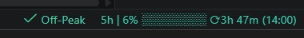

<div dir="rtl">

# Claude Code Statusline

תוסף קליל ל-VS Code שמציג את **אחוזי השימוש בסשן** ואת **שעות השיא** של Claude Code ישירות בשורת הסטטוס.



## מה מוצג

<table dir="rtl">
<tr><th>פריט</th><th>מתי מוצג</th><th>דוגמה</th></tr>
<tr><td><b>שימוש 5 שעות</b></td><td>תמיד (כשמחוברים)</td><td dir="ltr"><code>5h | 47% ████░░░░ ⟳2h 05m (17:35)</code></td></tr>
<tr><td><b>שימוש 7 ימים</b></td><td>רק מעל 50%</td><td dir="ltr"><code>7d | 62% █████░░░</code></td></tr>
<tr><td><b>מחוץ לשיא</b></td><td>תמיד</td><td dir="ltr"><code>✓ Off-Peak</code> (ספירה לאחור רק בשעה האחרונה לפני השיא)</td></tr>
<tr><td><b>שעת שיא</b></td><td>בזמן Peak</td><td dir="ltr"><code>🔥 Peak — 2h 05m left (14:00-20:00)</code></td></tr>
</table>

<ul dir="rtl">
<li>אחוזי השימוש נשלפים מ-OAuth API של Anthropic&rlm; (אותו טוקן שכבר קיים ב-Claude Code&rlm;)</li>
<li>לוח זמני שעות השיא נטען מ-<a href="https://github.com/Nadav-Fux/claude-2x-statusline">Nadav-Fux/claude-2x-statusline</a></li>
<li>רענון אוטומטי כל 30 שניות (ניתן להגדרה)</li>
<li>פורמט שעון 24H</li>
</ul>

## התקנה

### התקנה מהירה (העתיקו כפרומפט לקלוד)

<blockquote dir="rtl">
התקן את התוסף Claude Code Statusline מתוך קוד מקור:
</blockquote>

```
git clone https://github.com/arielmoatti/claude-code-vsc-statusline.git
cd claude-code-vsc-statusline
npm install
npm run compile
npx @vscode/vsce package
code --install-extension claude-code-vsc-statusline-0.1.0.vsix
```

### התקנה ידנית

<ol dir="rtl">
<li>שכפלו את הריפו</li>
<li><code dir="ltr">npm install && npm run compile</code></li>
<li><code dir="ltr">npx @vscode/vsce package</code></li>
<li>ב-VS Code&rlm;: Extensions > <code>...</code> > Install from VSIX > בחרו את קובץ ה-<code dir="ltr">.vsix</code></li>
</ol>

## הגדרות

<table dir="rtl">
<tr><th>הגדרה</th><th>ברירת מחדל</th><th>תיאור</th></tr>
<tr><td dir="ltr"><code>claudeStatusline.refreshInterval</code></td><td>30</td><td>תדירות רענון בשניות</td></tr>
<tr><td dir="ltr"><code>claudeStatusline.showRateLimits</code></td><td>true</td><td>הצגת שימוש 5h / 7d</td></tr>
<tr><td dir="ltr"><code>claudeStatusline.showPeakHours</code></td><td>true</td><td>הצגת שעות שיא</td></tr>
</table>

## דרישות

<ul dir="rtl">
<li><b>Claude Code</b> מותקן ומחובר (התוסף קורא את טוקן ה-OAuth הקיים)</li>
<li>אין צורך במפתחות API נוספים</li>
</ul>

## קרדיט

מבוסס על <a href="https://github.com/Nadav-Fux/claude-2x-statusline">claude-2x-statusline</a> מאת <a href="https://github.com/Nadav-Fux">Nadav Fux</a>&rlm;. גרסה מופשטת ומעוצבת מחדש.

## רישיון

AGPL-3.0 (כמו המקור)

</div>
