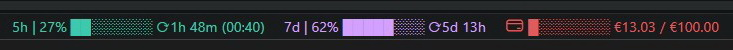

<div dir="rtl">

# Claude Code Statusline

תוסף קליל ל-VS Code שמציג את **אחוזי השימוש בסשן** ו-**חריגה מעבר למכסה** של Claude Code ישירות בשורת הסטטוס.
הפיצ'רים מסודרים מהחדש ביותר לישן.



---

<blockquote dir="rtl">

💡 <b>משהו לא מתרענן כצפוי?</b> <code>Ctrl+Shift+P</code> ← <code>Developer: Reload Window</code>. נתוני ה-usage נמשכים כל כמה עשרות שניות, אבל לפעמים אחרי עדכון של התוסף או שינוי של הגדרות — reload מיידי פותר הכל.

</blockquote>

## פיצ'רים

### ‏🆕 סקיל נלווה: statuswatch (אופציונלי)

התוסף נותן **לך** עין על המכסה - הסקיל נותן **ל-Claude** יד על הבלם.

statuswatch הוא סקיל ל-Claude Code שנשען על נתוני התוסף: כשאתם משגרים עבודה כבדה (צי סוכנים במקביל, workflow ארוך), הוא דוגם את המכסה ברקע **ועוצר את העבודה לפני שמכסת ה-5 שעות נגמרת** - כך שתמיד נשאר לכם מרווח (headroom) לעבוד במקביל, לעצור את הסשן, או פשוט לא להינעל בחוץ. מכסת ה-5 שעות היא חשבונית-רוחבית: פרומפט אחד גרגרני יכול להשבית אתכם בכל הפלטפורמות, כולל מהנייד. הסקיל קיים בדיוק בשביל למנוע את זה.

בונוס למשימות ענק: **עבודה במשמרות** - עוצר בתקרה, ממתין לאיפוס המכסה (הוא יודע מה-statusline בדיוק מתי), ממשיך מאותה נקודה, וחוזר חלילה עד השלמת המשימה. טייס אוטומטי לכל הלילה.

<details>
<summary><b>איך זה עובד + התקנה</b></summary>
<div dir="rtl">

**הארכיטקטורה:** התוסף כותב את נתוני ה-usage לקובץ cache מקומי (`<tmp>/claude/statusline-usage-cache.json`). הסקיל קורא את הקובץ הזה - ורק אותו. statusline = החיישן, statuswatch = הבקר. בלי התוסף, ל-Claude אין שום דרך לדעת כמה מכסה נשארה.

**מה הסקיל עושה ומה לא:**

<ul dir="rtl">
<li>✅ קורא קובץ מקומי אחד. עוצר עבודה רצה. מתזמן לעצמו בדיקות רקע</li>
<li>❌ אפס קריאות רשת, אפס גישה ל-credentials, שום דבר לא יוצא מהמחשב</li>
<li>❌ לא מפעיל את עצמו - רץ רק כשמבקשים ממנו</li>
</ul>

**הברירות מחדל ולמה:** דגימה כל ≈150 שניות בזמן עבודה כבדה - כי התוסף עצמו מתרענן כל ≈120 שניות (דגימה צפופה יותר סתם קוראת את אותו ערך; דלילה מדי מפספסת קפיצות של 20%+, כי צי סוכנים כבד שורף עד ≈4.5% לדקה). סף העצירה יושב ≈10 נקודות מתחת לתקרה שבחרתם, כדי שגם קפיצה של אינטרוול שלם תנחת בתקרה ולא מעבר לה. את התקרה עצמה (85% מומלץ / 90 / 75 / 60) בוחרים באשף ההתקנה.

**התקנה (דרך Claude Code, אין שום npm):** הדביקו לקלוד את הפרומפט הבא, והוא יריץ אשף קצר בעברית - שתי שאלות (תקרה + ביטויי הפעלה) - ויכתוב את הסקיל מותאם אישית:

<blockquote dir="rtl">
קרא את ההוראות מ-https://raw.githubusercontent.com/arielmoatti/claude-code-vsc-statusline/HEAD/skill/INSTALL.md ופעל לפיהן להתקנת סקיל statuswatch.
</blockquote>

ההעדפות נצרבות לתוך קובץ הסקיל עצמו (`~/.claude/skills/statuswatch/SKILL.md`) - אין קובץ קונפיג נפרד. אחרי ההתקנה מפעילים אותו בשפה טבעית, תוך כדי שיחה: <i>"...יאללה צא לדרך, אבל שמור לי על המכסה"</i>.

</div>
</details>

### חריגת שימוש (Extra usage)

כשהמכסה השעתית או השבועית מגיעה ל-100% ו-**בחשבון מופעל "switch to extra usage"**, התוסף מציג פס נוסף בקצה הימני של שורת הסטטוס: `$(credit-card) ▓▓░░░░░░ €X.XX / €Y.YY` באדום.

<ul dir="rtl">
<li><b>מתי מוצג:</b> רק בפועל בזמן חריגה — כלומר <code dir="ltr">five_hour.utilization ≥ 100</code> או <code dir="ltr">seven_day.utilization ≥ 100</code>. לא סתם מבוסס על "הפיצ'ר מופעל בחשבון" — זה היה רעש מיותר, שעון הסטטוס לא צריך להתריע על מה שלא קורה כרגע</li>
<li><b>מטבע:</b> מזוהה אוטומטית לפי מדינת Windows. ספרד/גרמניה/צרפת וכו' ← €, בריטניה ← £, <b>ישראל ← $</b> (אנתרופיק מחייבים חשבונות IL בדולרים גם כשמערכת ההפעלה מציגה ₪), ברירת מחדל ← $</li>
<li><b>ניתן לעקוף</b> דרך הגדרת <code dir="ltr">claudeStatusline.currencySymbol</code></li>
<li><b>פורמט:</b> סכומים מחושבים מיחידות מינור של ה-API (סנטים) — <code>720 → €7.20</code></li>
</ul>

### שימוש 5 שעות

תמיד מוצג (כשמחוברים): `5h | 47% ████░░░░ ⟳2h 05m (17:35)` — אחוז, פס סוללה, countdown לאיפוס, ושעת איפוס.

<ul dir="rtl">
<li>צבעים: ירוק (<50%), כתום (50-79%), אדום (≥80%)</li>
<li><b>grace בסמוך לאיפוס:</b> כשנשארו פחות מ-15 דקות עד האיפוס, אדום → כתום. לא צריך להיכנס לפאניקה על 85% ב-10 דקות לפני reset</li>
<li>שעת האיפוס בסוגריים מוצגת רק כשפחות מ-24 שעות עד האיפוס (אחרת זה סתם רעש — "13:00" לא אומר איזה יום)</li>
</ul>

### שימוש 7 ימים

מוצג **רק מעל 50%**: `7d | 62% █████░░░ ⟳5d 13h`.

<ul dir="rtl">
<li>מתחת ל-50% לא מציק — פשוט לא נראה</li>
<li>countdown מתאים את עצמו: ימים+שעות, שעות+דקות, או דקות בלבד — תמיד 2 יחידות מידע מרביות</li>
</ul>

---

## התקנה

### התקנה מהירה (העתיקו כפרומפט לקלוד)

<blockquote dir="rtl">
התקן את התוסף Claude Code Statusline מתוך קוד מקור:
</blockquote>

```
git clone https://github.com/arielmoatti/claude-code-vsc-statusline.git
cd claude-code-vsc-statusline
npm install
npm run compile
npx @vscode/vsce package
code --install-extension claude-code-vsc-statusline-*.vsix --force
```

### התקנה ידנית

<ol dir="rtl">
<li>שכפלו את הריפו</li>
<li><code dir="ltr">npm install && npm run compile</code></li>
<li><code dir="ltr">npx @vscode/vsce package</code></li>
<li>ב-VS Code&rlm;: Extensions > <code>...</code> > Install from VSIX > בחרו את קובץ ה-<code dir="ltr">.vsix</code></li>
</ol>

---

## הגדרות

<table dir="rtl">
<tr><th>הגדרה</th><th>ברירת מחדל</th><th>תיאור</th></tr>
<tr><td dir="ltr"><code>claudeStatusline.refreshInterval</code></td><td>120</td><td>תדירות רענון בסיסית בשניות</td></tr>
<tr><td dir="ltr"><code>claudeStatusline.showRateLimits</code></td><td>true</td><td>הצגת שימוש 5h / 7d / extra</td></tr>
<tr><td dir="ltr"><code>claudeStatusline.currencySymbol</code></td><td>(אוטומטי)</td><td>עקיפת הזיהוי האוטומטי של סמל המטבע. ריק ← לפי מדינת Windows</td></tr>
</table>

---

## דרישות

<ul dir="rtl">
<li><b>Claude Code</b> מותקן ומחובר (התוסף קורא את טוקן ה-OAuth הקיים)</li>
<li>אין צורך במפתחות API נוספים</li>
</ul>

---

## קרדיט

מבוסס על <a href="https://github.com/Nadav-Fux/claude-2x-statusline">claude-2x-statusline</a> מאת <a href="https://github.com/Nadav-Fux">Nadav Fux</a>&rlm;. גרסה מופשטת ומעוצבת מחדש, עם תוספות: פס חריגה (extra usage), זיהוי מטבע אוטומטי, coordination בין חלונות, ו-backoff חכם.

## רישיון

AGPL-3.0 (כמו המקור)

</div>

---

<details>
<summary>English version</summary>

> [!TIP]
> 💡 **Something not refreshing as expected?** `Ctrl+Shift+P` → `Developer: Reload Window`. Usage data polls every minute or two, but after an extension update or settings change, an immediate reload fixes everything.

## Features

Ordered newest-first.

### 🆕 Companion skill: statuswatch (optional)

The extension gives **you** an eye on the quota - the skill gives **Claude** a hand on the brake.

statuswatch is a Claude Code skill built on top of this extension's data: when you launch heavy work (a fleet of parallel agents, a long workflow), it samples the quota in the background and **stops the work BEFORE the 5-hour window runs out** - so you always keep headroom to work in parallel, stop the session, or simply not get locked out. The 5h window is account-wide: one greedy prompt can lock you out on every surface, including your phone. The skill exists to prevent exactly that.

Bonus for oversized missions: **shift work** - stop at the cap, wait for the quota reset (it knows exactly when, from the statusline), resume where it left off, repeat until the mission completes. All-night autopilot.

<details>
<summary><b>How it works + install</b></summary>

**Architecture:** the extension writes usage data to a local cache file (`<tmp>/claude/statusline-usage-cache.json`). The skill reads that file - and nothing else. statusline = the sensor, statuswatch = the controller. Without the extension, Claude has no way to know how much quota remains.

**What the skill does / does not do:**

- ✅ Reads one local file. Stops running work. Schedules its own background checks.
- ❌ Zero network calls, zero credential access, nothing leaves the machine.
- ❌ Never self-activates - runs only when you ask.

**The defaults and why:** sampling every ≈150s during heavy work - because the extension itself refreshes every ≈120s (denser sampling just re-reads the same value; sparser misses 20%+ jumps, since a heavy agent fleet burns up to ≈4.5%/min). The stop trigger sits ≈10 points below your chosen cap, so even a full-interval jump lands at the cap, not past it. The cap itself (85% recommended / 90 / 75 / 60) is chosen in the install wizard.

**Install (via Claude Code, no npm involved):** paste this prompt to Claude; it runs a short wizard - two questions (cap + trigger phrases) - and writes your personalized skill:

> Read the instructions at https://raw.githubusercontent.com/arielmoatti/claude-code-vsc-statusline/HEAD/skill/INSTALL.md and follow them to install the statuswatch skill. (The wizard speaks Hebrew by default - ask Claude to run it in English if you prefer.)

Your preferences are baked into the skill file itself (`~/.claude/skills/statuswatch/SKILL.md`) - no separate config file. After install, invoke it in natural language, mid-conversation: *"...go ahead, but keep an eye on the quota"*.

</details>

### Extra usage

When your 5-hour or 7-day quota hits 100% **and** your account has "switch to extra usage" enabled, a new bar appears at the right edge of the status bar: `$(credit-card) ▓▓░░░░░░ €X.XX / €Y.YY` in red.

- **When shown:** only during actual overage — `five_hour.utilization ≥ 100` or `seven_day.utilization ≥ 100`. Not simply "overage enabled on the account" — the status line shouldn't alert on capability, only on current state.
- **Currency:** auto-detected from your Windows locale. Spain/Germany/France/etc. → €, UK → £, **Israel → $** (Anthropic bills IL accounts in USD even when the OS shows ₪), default → $.
- **Override** via `claudeStatusline.currencySymbol`.
- **Formatting:** values come from the API in minor units (cents). `720 → €7.20`.

### 5-hour usage

Always shown (when logged in): `5h | 47% ████░░░░ ⟳2h 05m (17:35)` — percent, battery bar, reset countdown, and reset clock time.

- Colors: green (<50%), orange (50-79%), red (≥80%)
- **Near-reset grace:** when less than 15 min remains before reset, red → orange. No panic over 85% at 10 minutes to go.
- The clock time in parentheses appears only when less than 24h to reset (otherwise it's noise — "13:00" doesn't say which day).

### 7-day usage

Shown **only above 50%**: `7d | 62% █████░░░ ⟳5d 13h`.

- Below 50%, invisible — out of your way.
- Countdown adapts to scale: days+hours, hours+minutes, or minutes-only — always up to 2 units.

---

## Install

### Quick (paste as a prompt to Claude)

> Install the Claude Code Statusline extension from source:

```
git clone https://github.com/arielmoatti/claude-code-vsc-statusline.git
cd claude-code-vsc-statusline
npm install
npm run compile
npx @vscode/vsce package
code --install-extension claude-code-vsc-statusline-*.vsix --force
```

### Manual

1. Clone the repo
2. `npm install && npm run compile`
3. `npx @vscode/vsce package`
4. In VS Code: Extensions > `...` > Install from VSIX > pick the `.vsix` file

---

## Configuration

| Setting | Default | Description |
|---|---|---|
| `claudeStatusline.refreshInterval` | 120 | Base refresh interval in seconds |
| `claudeStatusline.showRateLimits` | true | Show 5h / 7d / extra usage bars |
| `claudeStatusline.currencySymbol` | *(auto)* | Override auto-detected currency symbol. Empty → detected from Windows locale |

---

## Requirements

- **Claude Code** installed and logged in (the extension reads the existing OAuth token)
- No additional API keys required

---

## Credit

Based on [claude-2x-statusline](https://github.com/Nadav-Fux/claude-2x-statusline) by [Nadav Fux](https://github.com/Nadav-Fux). Stripped down and redesigned, with additions: extra-usage bar, auto currency detection, cross-window coordination, and smarter backoff.

## License

AGPL-3.0 (same as upstream)

</details>
