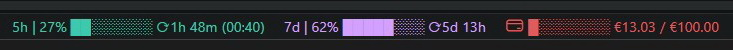
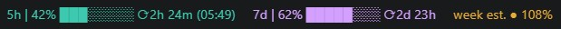

<div dir="rtl">

# Claude Code Statusline

תוסף קליל ל-VS Code שמציג את **אחוזי השימוש בסשן** ו-**חריגה מעבר למכסה** של Claude Code ישירות בשורת הסטטוס.
הפיצ'רים מסודרים מהחדש ביותר לישן.



---

<blockquote dir="rtl">

💡 <b>משהו לא מתרענן כצפוי?</b> <code>Ctrl+Shift+P</code> ← <code>Developer: Reload Window</code>. נתוני ה-usage נמשכים כל כמה עשרות שניות, אבל לפעמים אחרי עדכון של התוסף או שינוי של הגדרות — reload מיידי פותר הכל.

</blockquote>

## פיצ'רים

### ‏🆕 הערכת מכסה שבועית (week est.)

**"בקצב הזה, אני נגמר לפני שהשבוע נגמר?"**

הפס השבועי אומר לכם כמה שרפתם. הוא לא אומר את הדבר היחיד שמאפשר לתכנן: **לאן אתם הולכים.** `62%` ביום רביעי זה מצוין או אסון, תלוי לגמרי כמה מהשבוע כבר עבר וכמה מהר אתם שורפים - וזה חישוב שאף אחד לא עושה בראש באמצע עבודה.

הפריט הזה עושה אותו: `week est. ● 108%` פירושו **"בקצב הנוכחי תנחת על 108% בסוף השבוע"**, כלומר תיתקעו לפני האיפוס.



<ul dir="rtl">
<li><b>ירוק</b> - נוחתים מתחת ל-100%. אין קיר</li>
<li><b>כתום</b> - 100% עד 115%. תגיעו לקיר, אבל רק ביממה האחרונה של השבוע</li>
<li><b>אדום</b> - מעל 115%. תיתקעו יותר מיום שלם לפני האיפוס</li>
<li>מוצג <b>תמיד</b>, גם כשהפס השבועי מוסתר מתחת ל-50% - שם בדיוק הוא שווה משהו, כי ב-60% כבר מאוחר מדי לתכנן מחדש</li>
</ul>

<details dir="rtl">
<summary><b>למה זה לא סתם אחוז חלקי הזמן שעבר</b></summary>
<div dir="rtl">

החישוב המתבקש הוא `אחוז ÷ חלק השבוע שעבר`. הוא **שגוי בצורה מסוכנת**: המכסה השבועית נצברת לפי שעון קיר, אבל אתם שורפים אותה רק כשאתם עובדים. שינה של שמונה שעות "משפרת" את המספר לבד.

אותם 14% בדיוק, בשתי הדרכים:

<table dir="rtl">
<tr><th>רגע</th><th>לפי שעון קיר</th><th>לפי שעות עבודה</th></tr>
<tr><td>23:30, אחרי 6 שעות עבודה</td><td>152% 🔴</td><td>139% 🔴</td></tr>
<tr><td>07:00, אחרי שינה</td><td>102% 🟠</td><td>132% 🔴</td></tr>
</table>

החישוב הנאיבי מרגיע אתכם בבוקר בזמן ששום דבר לא השתנה - לא עבדתם ולא הרווחתם מכסה, רק עבר הזמן. אתם קמים, רואים כתום, וממשיכים באותו קצב ישר לתוך הקיר.

לכן הקצב כאן נמדד **לשעת עבודה** ולא לשעת שעון. התוסף רושם דגימה בכל רענון לקובץ קטן (`<tmp>/claude/statusline-usage-history.jsonl`), ומשחזר ממנו כמה שעות באמת עבדתם: מקטע נחשב עבודה רק אם המכסה השבועית זזה בו. פער שאף אחד לא דגם בו לא נספר כעבודה.

שלושה פרטים שנובעים מזה:

<ul dir="rtl">
<li><b>מה שמריץ headless נספר גם הוא.</b> <code>usage-poll.cjs</code> כותב לאותו קובץ, אחרת כל עבודה מהטרמינל או מגשר צ'אט הייתה נראית כשעות סרק והקצב היה יוצא רגוע מדי</li>
<li><b>בתחילת השבוע ההערכה נשענת על השבוע הקודם</b> ומתחלפת בהדרגה לנתוני השבוע הנוכחי, כדי שהמספר לא יקפוץ בגלל מכנה של שעתיים</li>
<li><b>ה-API יכול לתקן את המספר השבועי כלפי מטה באמצע חלון</b> (נצפה חי 01.09.2026, 6% ← 2% בזמן עבודה רצופה, עם <code>resets_at</code> ללא שינוי). לכן כל דגימה נושאת גם את מזהה החלון שלה, והשריפה נמדדת כשינוי נטו בתוך כל חלון - אחרת תיקון כזה היה נספר כשריפה ומנפח את הקצב לתמיד</li>
</ul>

</div>
</details>

### סקיל נלווה: statuswatch (אופציונלי)

התוסף נותן **לך** עין על המכסה - הסקיל נותן **ל-Claude** יד על הבלם.

סקיל statuswatch נשען על נתוני התוסף: כשאתם משגרים עבודה כבדה (צי סוכנים במקביל, workflow ארוך), הוא דוגם את המכסה ברקע **ועוצר את העבודה לפני שמכסת ה-5 שעות נגמרת** - כך שתמיד נשאר לכם מרווח (headroom) לעבוד במקביל, לעצור את הסשן, או פשוט לא להינעל בחוץ. מכסת ה-5 שעות היא חשבונית-רוחבית: פרומפט אחד גרגרני יכול להשבית אתכם בכל הפלטפורמות, כולל מהנייד. הסקיל קיים בדיוק בשביל למנוע את זה.

בונוס למשימות ענק: **עבודה במשמרות** - עוצר בתקרה, ממתין לאיפוס המכסה (הוא יודע מה-statusline בדיוק מתי), ממשיך מאותה נקודה, וחוזר חלילה עד השלמת המשימה. טייס אוטומטי לכל הלילה.

להתקנה, יש ללחוץ ולהרחיב את הפסקה מתחת...

<details dir="rtl">
<summary><b>איך זה עובד + התקנה</b></summary>
<div dir="rtl">

**הארכיטקטורה:** התוסף כותב את נתוני ה-usage לקובץ cache מקומי (`<tmp>/claude/statusline-usage-cache.json`). הסקיל קורא את הקובץ הזה - ורק אותו. statusline = החיישן, statuswatch = הבקר. בלי התוסף, ל-Claude אין שום דרך לדעת כמה מכסה נשארה.

**מה הסקיל עושה ומה לא:**

<ul dir="rtl">
<li>✅ בדרך כלל קורא קובץ מקומי אחד. עוצר עבודה רצה. מתזמן לעצמו בדיקות רקע</li>
<li>❌ לא מוסיף שום משטח רשת - אפס צד שלישי, אפס טלמטריה, אפס אנליטיקס. הבקשה היחידה שאי פעם נשלחת בשמו היא הפולר ל-headless שמתואר למטה: שאילתת המכסה שלכם, ל-API של Anthropic עצמה, עם הטוקן שלכם - בדיוק אותה בקשה שהתוסף ממילא שולח בטיימר שלו</li>
<li>❌ לא מפעיל את עצמו - רץ רק כשמבקשים ממנו</li>
</ul>

**הברירות מחדל ולמה:** דגימה כל ≈150 שניות בזמן עבודה כבדה - כי התוסף עצמו מתרענן כל ≈120 שניות (דגימה צפופה יותר סתם קוראת את אותו ערך; דלילה מדי מפספסת קפיצות של 20%+, כי צי סוכנים כבד שורף עד ≈4.5% לדקה). סף העצירה יושב ≈10 נקודות מתחת לתקרה שבחרתם, כדי שגם קפיצה של אינטרוול שלם תנחת בתקרה ולא מעבר לה. את התקרה עצמה (85% מומלץ / 90 / 75 / 60) בוחרים באשף ההתקנה.

**התקנה (דרך Claude Code, אין שום npm):** הדביקו לקלוד את הפרומפט הבא, והוא יריץ אשף קצר בעברית - שתי שאלות (תקרה + ביטויי הפעלה) - ויכתוב את הסקיל מותאם אישית:

```
קרא את ההוראות מ-https://raw.githubusercontent.com/arielmoatti/claude-code-vsc-statusline/HEAD/skill/INSTALL.md ופעל לפיהן להתקנת סקיל statuswatch.
```

ההעדפות נצרבות לתוך קובץ הסקיל עצמו (`~/.claude/skills/statuswatch/SKILL.md`) - אין קובץ קונפיג נפרד. אחרי ההתקנה מפעילים אותו בשפה טבעית, תוך כדי שיחה: <i>"...יאללה צא לדרך, אבל שמור לי על המכסה"</i>.

<b>סשן ללא VSCode (headless):</b> התוסף הוא החיישן, ולכן כשאין חלון עורך פתוח אף אחד לא מרענן את ה-cache - ו-statuswatch קורא מספרים שעשויים להיות בני שעות, מה שגרוע יותר מלא לקרוא כלום. אם אתם מריצים את Claude Code בלי עורך (דיימון של Agent SDK, גשר צ'אט, cron/CI, או <code>claude</code> בטרמינל), הריצו את הפולר המצורף לפני כל בדיקה:

```bash
node scripts/usage-poll.cjs          # רענון + שורת סיכום אחת
node scripts/usage-poll.cjs --read   # הדפסת ה-cache כמו שהוא, בלי רשת
```

אותו endpoint, אותו טוקן, אותו קובץ cache כמו התוסף - רק מונע בשעון אחר. זה לא עולה טוקנים של מודל (חישוב מקומי), כך שדופק שקורא לו הוא חינם מבחינת המכסה.

</div>
</details>

### חריגת שימוש (Extra usage)

כשהמכסה השעתית או השבועית מגיעה ל-100% ו-**בחשבון מופעל "switch to extra usage"**, התוסף מציג פס נוסף בקצה הימני של שורת הסטטוס: `$(credit-card) ▓▓░░░░░░ €X.XX / €Y.YY` באדום.

<ul dir="rtl">
<li><b>מתי מוצג:</b> רק בפועל בזמן חריגה — כלומר <code dir="ltr">five_hour.utilization ≥ 100</code> או <code dir="ltr">seven_day.utilization ≥ 100</code>. לא סתם מבוסס על "הפיצ'ר מופעל בחשבון" — זה היה רעש מיותר, שעון הסטטוס לא צריך להתריע על מה שלא קורה כרגע</li>
<li><b>מטבע:</b> מזוהה אוטומטית לפי מדינת Windows. ספרד/גרמניה/צרפת וכו' ← €, בריטניה ← £, <b>ישראל ← $</b> (אנתרופיק מחייבים חשבונות IL בדולרים גם כשמערכת ההפעלה מציגה ₪), ברירת מחדל ← $</li>
<li><b>ניתן לעקוף</b> דרך הגדרת <code dir="ltr">claudeStatusline.currencySymbol</code></li>
<li><b>פורמט:</b> סכומים מחושבים מיחידות מינור של ה-API (סנטים) — <code>720 → €7.20</code></li>
</ul>

### שימוש 5 שעות

תמיד מוצג (כשמחוברים): `5h | 47% ████░░░░ ⟳2h 05m (17:35)` — אחוז, פס סוללה, countdown לאיפוס, ושעת איפוס.

<ul dir="rtl">
<li>צבעים: ירוק (<50%), כתום (50-79%), אדום (≥80%)</li>
<li><b>grace בסמוך לאיפוס:</b> כשנשארו פחות מ-15 דקות עד האיפוס, אדום → כתום. לא צריך להיכנס לפאניקה על 85% ב-10 דקות לפני reset</li>
<li>שעת האיפוס בסוגריים מוצגת רק כשפחות מ-24 שעות עד האיפוס (אחרת זה סתם רעש — "13:00" לא אומר איזה יום)</li>
</ul>

### שימוש 7 ימים

מוצג **רק מעל 50%**: `7d | 62% █████░░░ ⟳5d 13h`.

<ul dir="rtl">
<li>מתחת ל-50% לא מציק — פשוט לא נראה</li>
<li>countdown מתאים את עצמו: ימים+שעות, שעות+דקות, או דקות בלבד — תמיד 2 יחידות מידע מרביות</li>
</ul>

---

## התקנה

### התקנה מהירה (העתיקו כפרומפט לקלוד)

<blockquote dir="rtl">
התקן את התוסף Claude Code Statusline מתוך קוד מקור:
</blockquote>

```
git clone https://github.com/arielmoatti/claude-code-vsc-statusline.git
cd claude-code-vsc-statusline
npm install
npm run compile
npx @vscode/vsce package
code --install-extension claude-code-vsc-statusline-*.vsix --force
```

### התקנה ידנית

<ol dir="rtl">
<li>שכפלו את הריפו</li>
<li><code dir="ltr">npm install && npm run compile</code></li>
<li><code dir="ltr">npx @vscode/vsce package</code></li>
<li>ב-VS Code&rlm;: Extensions > <code>...</code> > Install from VSIX > בחרו את קובץ ה-<code dir="ltr">.vsix</code></li>
</ol>

---

## הגדרות

<table dir="rtl">
<tr><th>הגדרה</th><th>ברירת מחדל</th><th>תיאור</th></tr>
<tr><td dir="ltr"><code>claudeStatusline.refreshInterval</code></td><td>120</td><td>תדירות רענון בסיסית בשניות</td></tr>
<tr><td dir="ltr"><code>claudeStatusline.showRateLimits</code></td><td>true</td><td>הצגת שימוש 5h / 7d / extra</td></tr>
<tr><td dir="ltr"><code>claudeStatusline.showWeeklyPace</code></td><td>true</td><td>הצגת הערכת המכסה השבועית (<code dir="ltr">week est.</code>)</td></tr>
<tr><td dir="ltr"><code>claudeStatusline.currencySymbol</code></td><td>(אוטומטי)</td><td>עקיפת הזיהוי האוטומטי של סמל המטבע. ריק ← לפי מדינת Windows</td></tr>
</table>

---

## דרישות

<ul dir="rtl">
<li><b>Claude Code</b> מותקן ומחובר (התוסף קורא את טוקן ה-OAuth הקיים)</li>
<li>אין צורך במפתחות API נוספים</li>
</ul>

---

## קרדיט

מבוסס על <a href="https://github.com/Nadav-Fux/claude-2x-statusline">claude-2x-statusline</a> מאת <a href="https://github.com/Nadav-Fux">Nadav Fux</a>&rlm;. גרסה מופשטת ומעוצבת מחדש, עם תוספות: פס חריגה (extra usage), זיהוי מטבע אוטומטי, coordination בין חלונות, ו-backoff חכם.

## רישיון

AGPL-3.0 (כמו המקור)

</div>

---

<details>
<summary>English version</summary>

> [!TIP]
> 💡 **Something not refreshing as expected?** `Ctrl+Shift+P` → `Developer: Reload Window`. Usage data polls every minute or two, but after an extension update or settings change, an immediate reload fixes everything.

## Features

Ordered newest-first.

### 🆕 Weekly quota estimate (week est.)

**"At this rate, do I run out before the week does?"**

The weekly bar tells you how much you have burned. It does not tell you the one thing you can plan around: **where you are heading.** `62%` on a Wednesday is either fine or a disaster depending entirely on how much of the week has passed and how fast you are burning — a calculation nobody does in their head mid-work.

This item does it: `week est. ● 108%` means **"at the current rate you land at 108% by reset"**, i.e. you hit the wall before the week ends.


- **Green** — landing under 100%. No wall.
- **Orange** — 100% to 115%. You hit the wall, but only in the last day of the week.
- **Red** — above 115%. You run dry more than a full day before reset.
- Shown **always**, including while the weekly bar is hidden below 50% — which is exactly where it earns its place, because at 60% it is already too late to re-plan.

<details>
<summary><b>Why this is not just percent-over-elapsed</b></summary>

The obvious formula is `utilization ÷ fraction of week elapsed`. It is **wrong in a dangerous way**: weekly quota accrues on wall-clock time, but you only burn it while you work. Sleep eight hours and the number improves on its own.

The same 14%, both ways:

| Moment | Wall clock | Per hour worked |
|---|---|---|
| 23:30, after 6 hours of work | 152% 🔴 | 139% 🔴 |
| 07:00, after sleeping | 102% 🟠 | 132% 🔴 |

The naive reading tells you to relax at breakfast while nothing has changed — you did not work and you did not earn quota, time simply passed. You wake up, see orange, and keep the same pace straight into the wall.

So the rate here is measured **per hour of work**, not per hour of clock. The extension appends a sample on every refresh to a small file (`<tmp>/claude/statusline-usage-history.jsonl`) and recovers actual working hours from it: an interval counts as work only if weekly utilization moved during it. A gap nobody sampled is not counted as work.

Three consequences:

- **Headless work counts too.** `usage-poll.cjs` writes to the same file — otherwise every terminal or chat-bridge session would look like idle time and the pace would read far too calm.
- **Early in the week the estimate leans on the previous week**, handing over gradually to the current week's data, so the number does not swing on a two-hour denominator.
- **The API can revise the weekly figure downward mid-window** (observed live 2026-09-01: 6% → 2% during continuous work, with `resets_at` unchanged). So every sample also carries its window id, and burn is measured as the net change inside each window — otherwise such a correction would be counted as burn and inflate the rate permanently.

</details>

### Companion skill: statuswatch (optional)

The extension gives **you** an eye on the quota - the skill gives **Claude** a hand on the brake.

statuswatch is a Claude Code skill built on top of this extension's data: when you launch heavy work (a fleet of parallel agents, a long workflow), it samples the quota in the background and **stops the work BEFORE the 5-hour window runs out** - so you always keep headroom to work in parallel, stop the session, or simply not get locked out. The 5h window is account-wide: one greedy prompt can lock you out on every surface, including your phone. The skill exists to prevent exactly that.

Bonus for oversized missions: **shift work** - stop at the cap, wait for the quota reset (it knows exactly when, from the statusline), resume where it left off, repeat until the mission completes. All-night autopilot.

<details>
<summary><b>How it works + install</b></summary>

**Architecture:** the extension writes usage data to a local cache file (`<tmp>/claude/statusline-usage-cache.json`). The skill reads that file - and nothing else. statusline = the sensor, statuswatch = the controller. Without the extension, Claude has no way to know how much quota remains.

**What the skill does / does not do:**

- ✅ Normally reads one local file. Stops running work. Schedules its own background checks.
- ❌ Adds no network surface - no third party, no telemetry, no analytics. The only request ever made on its behalf is the headless poller below: your own quota query, to Anthropic's own API, with your own Claude Code token - the same request the extension already makes on its own timer.
- ❌ Never self-activates - runs only when you ask.

**The defaults and why:** sampling every ≈150s during heavy work - because the extension itself refreshes every ≈120s (denser sampling just re-reads the same value; sparser misses 20%+ jumps, since a heavy agent fleet burns up to ≈4.5%/min). The stop trigger sits ≈10 points below your chosen cap, so even a full-interval jump lands at the cap, not past it. The cap itself (85% recommended / 90 / 75 / 60) is chosen in the install wizard.

**Install (via Claude Code, no npm involved):** paste this prompt to Claude; it runs a short wizard - two questions (cap + trigger phrases) - and writes your personalized skill:

```
Read the instructions at https://raw.githubusercontent.com/arielmoatti/claude-code-vsc-statusline/HEAD/skill/INSTALL.md and follow them to install the statuswatch skill.
```

*(The wizard speaks Hebrew by default - ask Claude to run it in English if you prefer.)*

Your preferences are baked into the skill file itself (`~/.claude/skills/statuswatch/SKILL.md`) - no separate config file. After install, invoke it in natural language, mid-conversation: *"...go ahead, but keep an eye on the quota"*.

**Headless sessions (no VSCode open):** the extension is the sensor, so with no editor running nothing refreshes the cache - statuswatch then reads numbers that can be hours old, which is worse than reading none. If you drive Claude Code headlessly (Agent SDK daemon, chat bridge, cron/CI, plain `claude` in a terminal), run the bundled poller before each check:

```bash
node scripts/usage-poll.cjs          # refresh + print one summary line
node scripts/usage-poll.cjs --read   # print the cache as-is, no network
```

Same endpoint, same token, same cache file as the extension - just driven by a different clock. It costs no model tokens (local compute), so a heartbeat that calls it is free against your quota.

</details>

### Extra usage

When your 5-hour or 7-day quota hits 100% **and** your account has "switch to extra usage" enabled, a new bar appears at the right edge of the status bar: `$(credit-card) ▓▓░░░░░░ €X.XX / €Y.YY` in red.

- **When shown:** only during actual overage — `five_hour.utilization ≥ 100` or `seven_day.utilization ≥ 100`. Not simply "overage enabled on the account" — the status line shouldn't alert on capability, only on current state.
- **Currency:** auto-detected from your Windows locale. Spain/Germany/France/etc. → €, UK → £, **Israel → $** (Anthropic bills IL accounts in USD even when the OS shows ₪), default → $.
- **Override** via `claudeStatusline.currencySymbol`.
- **Formatting:** values come from the API in minor units (cents). `720 → €7.20`.

### 5-hour usage

Always shown (when logged in): `5h | 47% ████░░░░ ⟳2h 05m (17:35)` — percent, battery bar, reset countdown, and reset clock time.

- Colors: green (<50%), orange (50-79%), red (≥80%)
- **Near-reset grace:** when less than 15 min remains before reset, red → orange. No panic over 85% at 10 minutes to go.
- The clock time in parentheses appears only when less than 24h to reset (otherwise it's noise — "13:00" doesn't say which day).

### 7-day usage

Shown **only above 50%**: `7d | 62% █████░░░ ⟳5d 13h`.

- Below 50%, invisible — out of your way.
- Countdown adapts to scale: days+hours, hours+minutes, or minutes-only — always up to 2 units.

---

## Install

### Quick (paste as a prompt to Claude)

> Install the Claude Code Statusline extension from source:

```
git clone https://github.com/arielmoatti/claude-code-vsc-statusline.git
cd claude-code-vsc-statusline
npm install
npm run compile
npx @vscode/vsce package
code --install-extension claude-code-vsc-statusline-*.vsix --force
```

### Manual

1. Clone the repo
2. `npm install && npm run compile`
3. `npx @vscode/vsce package`
4. In VS Code: Extensions > `...` > Install from VSIX > pick the `.vsix` file

---

## Configuration

| Setting | Default | Description |
|---|---|---|
| `claudeStatusline.refreshInterval` | 120 | Base refresh interval in seconds |
| `claudeStatusline.showRateLimits` | true | Show 5h / 7d / extra usage bars |
| `claudeStatusline.showWeeklyPace` | true | Show the weekly quota estimate (`week est.`) |
| `claudeStatusline.currencySymbol` | *(auto)* | Override auto-detected currency symbol. Empty → detected from Windows locale |

---

## Requirements

- **Claude Code** installed and logged in (the extension reads the existing OAuth token)
- No additional API keys required

---

## Credit

Based on [claude-2x-statusline](https://github.com/Nadav-Fux/claude-2x-statusline) by [Nadav Fux](https://github.com/Nadav-Fux). Stripped down and redesigned, with additions: extra-usage bar, auto currency detection, cross-window coordination, and smarter backoff.

## License

AGPL-3.0 (same as upstream)

</details>
